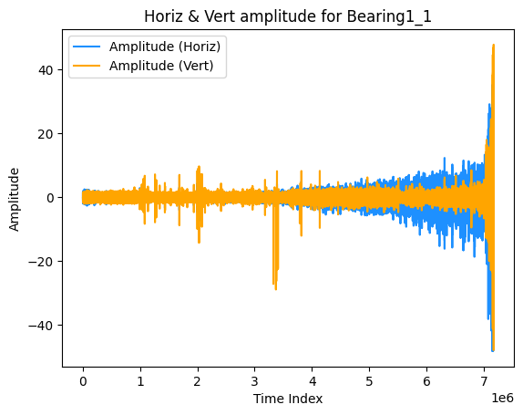
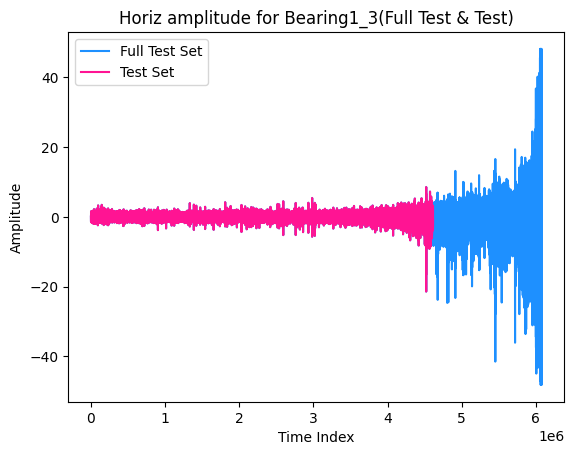

# Data preprocessing
repository for Data preprocessing

## Data report
- 디지털 대시보드 서비스 제공을 위한 Bearing RUL 예측 모델
- dataset: [IEEE phm 2012 data challenge](https://www.kaggle.com/datasets/alanhabrony/ieee-phm-2012-data-challenge)

## file description
### Augmentation
1. [CNN_LSTM_DataSet_Preparation.ipynb](augmentation/CNN_LSTM_DataSet_Preparation.ipynb)
   - 찬영님 help
2. [Delete_noisy.ipynb](augmentation/Delete_noisy.ipynb)
   - .
3. [G_Noisy.ipynb](augmentation/G_Noisy.ipynb)
   - .
4. [Noisy_data_pkz.ipynb](augmentation/Noisy_data_pkz.ipynb)
   - .
5. [sliding.ipynb](augmentation/sliding.ipynb)
   - 가윤님 help
### [EDA.ipynb](EDA.ipynb)
- you can get dataset plots

### Utils
1. merge_csv.ipynb
   - merge all .csv files on each bearing
   - change timestamp to datetime from accelaration .csv files
   - create folders for merged data
2. load_data
   - load_csv: load the merged CSV files and save them in a class

## Process
- data augmentation
   1. noise addition method : 찬영님 help
   2. window sliding method : 가윤님 help
- EDA

## Example of EDA result
- example of training data

-  example of test data


## Acknowledgement
```
“본 연구는 과학기술정보통신부 및 정보통신기획평가원의 SW전문인재양성사업의 연구결과로 수행되었음“(2022-0-01127)
```